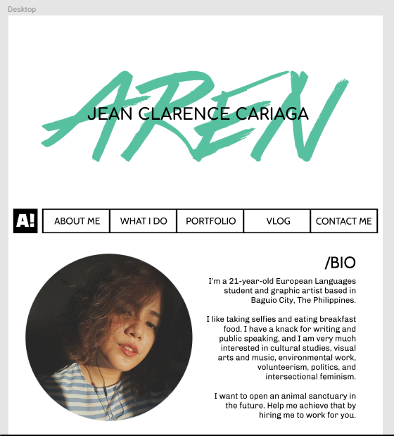

# Personal Portfolio

This website is the final project for the First Term. As I go through the course, I'll be updating this website. Creation of this website took about a week of planning and coding.

### What did I use

- HTML
- CSS
- JavaScript
- jQuery

### Design Process

1. Mood Board

Choosing the colors, fonts

2. Building the wireframes

I started coming up with the design based on a personal business card I designed last year.

3. Full designs on Figma

You can view the actual wireframes here: https://www.figma.com/file/Hg40uTk4MLJ3qv5qWEAs2zki/Personal-Website-Wireframe

4. Chose front-end Framework for UI elements
I was able to layout the contents with Bootstrap.

### Existing Bugs

- Didn't have documentation (FIXED 11/7/17)
- The Contact Form doesn't work yet

### Future Plans

- I plan to make the Contact Form fully functional when I learn PHP
- I want to add Leaflet.js to the "Where I've Been" section (once I figure it out)
